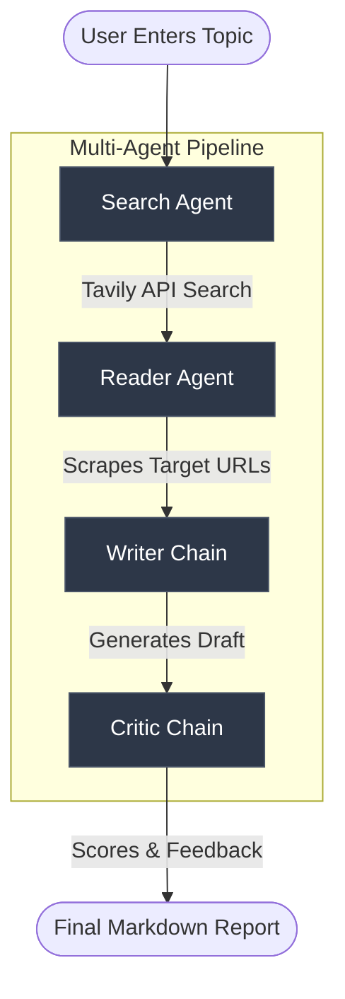

<div align="center">
  <h1>🔬 ResearchMind</h1>
  <p><strong>An autonomous multi-agent research pipeline built with Streamlit and LangChain</strong></p>

  [](https://www.python.org/)
  [](https://streamlit.io/)
  [](https://python.langchain.com/)
  [](LICENSE)
</div>

<br>

ResearchMind automates the workflow of a human researcher. You provide a topic, and the system spins up four specialized AI agents that collaborate to search the web, scrape deep content, draft a comprehensive report, and review it for quality.

---

## 🏗️ System Architecture

The pipeline executes sequentially, passing context from one specialized agent to the next:



## 🧠 Agent Roles

| Agent | Core Function | Technology / Tool |
| :--- | :--- | :--- |
| **Search Agent** | Queries the web for recent and highly relevant sources based on the user's prompt. | LangChain Agent + Tavily API |
| **Reader Agent** | Extracts the most relevant URLs and scrapes the underlying HTML for deep, factual content. | LangChain Agent + BeautifulSoup |
| **Writer Chain** | Synthesizes the scraped data into a structured, professional markdown report (Introduction, Findings, Conclusion, Sources). | Mistral AI + Prompt Templates |
| **Critic Chain** | Acts as an independent reviewer. Scores the draft out of 10 and provides actionable feedback on strengths and weaknesses. | Mistral AI + Prompt Templates |

---

## 🚀 Getting Started

### Prerequisites
- Python 3.11 or higher
- API Keys for **OpenAI** (or Mistral depending on your config) and **Tavily**

### Local Installation

1. **Clone the repository**
   ```bash
   git clone https://github.com/mrdhruv2005/Multi-Agent-System-Researcher.git
   cd Multi-Agent-System-Researcher
   ```

2. **Install dependencies**
   ```bash
   pip install -r requirements.txt
   ```

3. **Configure Environment Variables**
   Create a `.env` file in the project root:
   ```env
   OPENAI_API_KEY=your_openai_key_here
   TAVILY_API_KEY=your_tavily_key_here
   MISTRAL_API_KEY=your_mistral_key_here
   ```

4. **Launch the application**
   ```bash
   streamlit run app.py
   ```

---

## ☁️ Cloud Deployment (Streamlit Community Cloud)

This repository is pre-configured for seamless deployment on Streamlit Community Cloud.

1. Connect this repository to your Streamlit Cloud account.
2. Select `app.py` as your main file.
3. Choose **Python 3.11** as the runtime.
4. Add your `.env` variables into the **Streamlit Secrets** configuration panel.

**Note on Uptime:** A GitHub Action workflow (`.github/workflows/keep-awake.yml`) is included in this repository. It automatically pings the Streamlit app every hour to prevent it from entering sleep mode due to inactivity on the free tier.

## 📄 License

This project is licensed under the MIT License.
